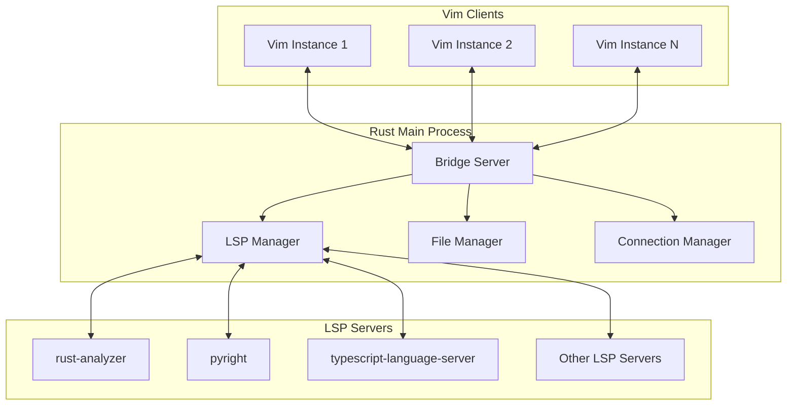
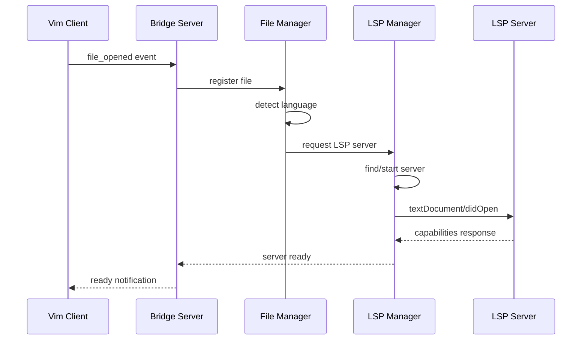
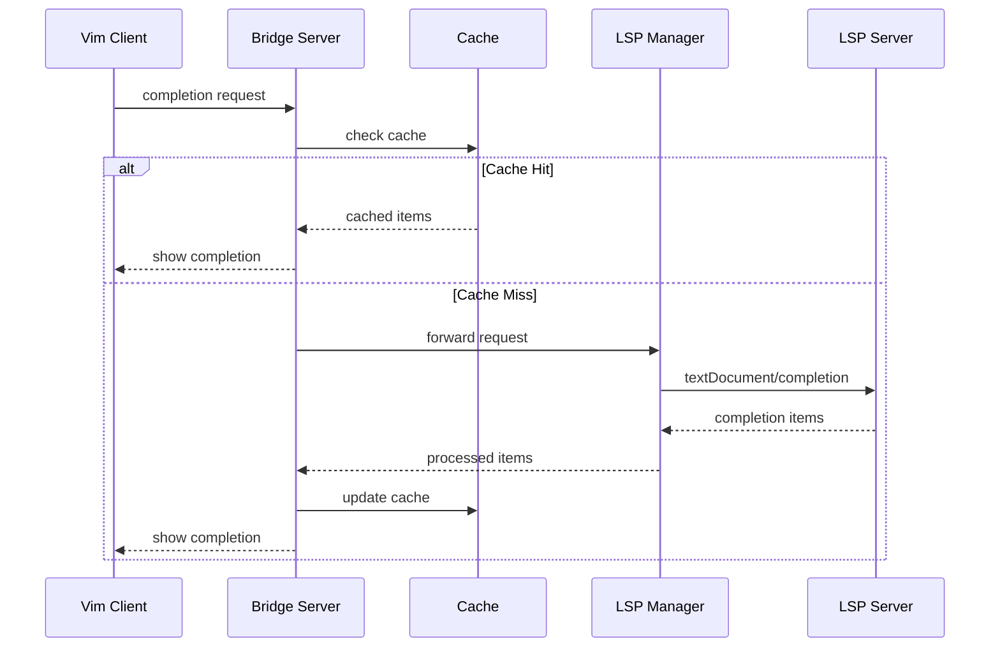
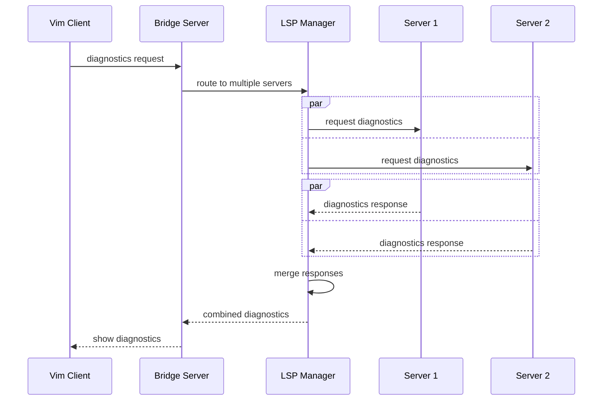

# 架构设计文档

## 1. 总体架构

### 1.1 设计理念

LSP-Bridge Rust 版本采用"反转控制"架构，颠覆了传统 LSP 客户端的设计模式：

- **传统模式**: 编辑器主导，LSP 客户端被动响应
- **反转模式**: LSP 服务统一管理，编辑器作为轻量级渲染前端

### 1.2 核心优势

1. **统一状态管理**: 所有 LSP 状态集中在 Rust 进程中
2. **多客户端支持**: 一个 Rust 进程可服务多个编辑器实例
3. **智能资源调度**: 根据项目活跃度动态管理 LSP 服务器
4. **状态持久化**: 编辑器重启不影响 LSP 状态

## 2. 系统架构图



## 3. 核心模块设计

### 3.1 Bridge Server (桥接服务器)

**职责**: 
- 管理与 Vim 客户端的连接
- 协调各模块间的交互
- 处理全局事件调度

**核心组件**:
```rust
pub struct BridgeServer {
    // 客户端连接管理
    vim_clients: HashMap<ClientId, VimClient>,
    
    // 核心管理器
    lsp_manager: LspManager,
    file_manager: FileManager,
    config: Config,
    
    // 事件系统
    event_bus: EventBus,
    
    // 连接监听器
    listener: TcpListener,
}
```

**关键特性**:
- 异步事件处理
- 客户端生命周期管理
- 错误恢复和重连机制

### 3.2 LSP Manager (LSP 管理器)

**职责**:
- 管理 LSP 服务器进程生命周期
- 处理 LSP 协议通信
- 协调多服务器请求

**架构设计**:
```rust
pub struct LspManager {
    // 活跃的 LSP 服务器
    servers: HashMap<ServerId, LspServerHandle>,
    
    // 服务器配置
    configs: HashMap<String, ServerConfig>,
    
    // 请求路由器
    router: RequestRouter,
    
    // 响应聚合器
    aggregator: ResponseAggregator,
}

pub struct LspServerHandle {
    process: Child,
    sender: LspSender,
    receiver: LspReceiver,
    capabilities: ServerCapabilities,
    status: ServerStatus,
}
```

**智能调度策略**:
1. **按需启动**: 打开文件时才启动对应 LSP 服务器
2. **空闲关闭**: 无活跃文件时自动关闭服务器
3. **资源共享**: 相同项目的文件共享 LSP 服务器实例
4. **故障恢复**: 服务器崩溃时自动重启

### 3.3 File Manager (文件管理器)

**职责**:
- 维护文件状态缓存
- 处理文件变更同步
- 管理文件与 LSP 服务器的映射关系

**数据结构**:
```rust
pub struct FileManager {
    // 文件状态缓存
    files: HashMap<FilePath, FileState>,
    
    // 文件到服务器的映射
    file_to_servers: HashMap<FilePath, Vec<ServerId>>,
    
    // 变更监听器
    watcher: FileWatcher,
    
    // 同步队列
    sync_queue: VecDeque<FileChange>,
}

pub struct FileState {
    uri: String,
    language_id: String,
    version: i32,
    content: String,
    last_modified: Instant,
    dirty: bool,
}
```

**同步策略**:
- **增量同步**: 只同步变更的文本片段
- **批量处理**: 合并短时间内的多个变更
- **优先级队列**: 用户当前编辑的文件优先同步

### 3.4 Connection Manager (连接管理器)

**职责**:
- 管理与 Vim 客户端的 TCP 连接
- 处理连接的建立、维护和断开
- 实现消息的可靠传输

**设计细节**:
```rust
pub struct ConnectionManager {
    // 活跃连接
    connections: HashMap<ClientId, ClientConnection>,
    
    // 连接池
    connection_pool: ConnectionPool,
    
    // 心跳管理
    heartbeat: HeartbeatManager,
    
    // 重连策略
    reconnect_policy: ReconnectPolicy,
}

pub struct ClientConnection {
    id: ClientId,
    stream: TcpStream,
    reader: FramedRead<ReadHalf<TcpStream>, LinesCodec>,
    writer: FramedWrite<WriteHalf<TcpStream>, LinesCodec>,
    last_activity: Instant,
    capabilities: ClientCapabilities,
}
```

## 4. 事件处理流程

### 4.1 文件打开流程



### 4.2 代码补全流程



### 4.3 多服务器协调流程



## 5. 性能优化设计

### 5.1 异步处理架构

```rust
// 主事件循环
async fn main_event_loop() {
    let mut bridge = BridgeServer::new().await;
    
    loop {
        tokio::select! {
            // 处理客户端连接
            Ok((stream, addr)) = bridge.listener.accept() => {
                tokio::spawn(handle_client_connection(stream, addr));
            }
            
            // 处理 LSP 响应
            Some(response) = bridge.lsp_receiver.recv() => {
                bridge.handle_lsp_response(response).await;
            }
            
            // 处理文件变更
            Some(change) = bridge.file_watcher.recv() => {
                bridge.handle_file_change(change).await;
            }
            
            // 定期维护任务
            _ = tokio::time::sleep(Duration::from_secs(30)) => {
                bridge.perform_maintenance().await;
            }
        }
    }
}
```

### 5.2 缓存策略

**多层缓存设计**:
1. **L1 缓存**: 内存中的热数据 (最近使用的补全、诊断)
2. **L2 缓存**: 压缩的历史数据 (文件内容快照)
3. **L3 缓存**: 磁盘持久化 (项目配置、索引数据)

**缓存失效策略**:
- 基于时间的 TTL
- 基于文件修改的智能失效
- LRU 淘汰策略

### 5.3 内存管理

**对象池设计**:
```rust
pub struct ObjectPool<T> {
    objects: Vec<T>,
    available: VecDeque<usize>,
    create_fn: Box<dyn Fn() -> T>,
}

// 预分配常用对象
static COMPLETION_ITEM_POOL: Lazy<ObjectPool<CompletionItem>> = 
    Lazy::new(|| ObjectPool::new(100, || CompletionItem::default()));

static TEXT_EDIT_POOL: Lazy<ObjectPool<TextEdit>> = 
    Lazy::new(|| ObjectPool::new(50, || TextEdit::default()));
```

**零拷贝优化**:
- 使用 `Cow<str>` 避免不必要的字符串复制
- 利用 `Arc` 共享不可变数据
- 流式处理大文件内容

## 6. 错误处理和恢复

### 6.1 故障模式分析

1. **LSP 服务器崩溃**: 自动重启，恢复文件状态
2. **网络连接中断**: 重连机制，状态同步
3. **文件系统错误**: 降级处理，用户提示
4. **内存不足**: 清理缓存，释放资源

### 6.2 恢复策略

```rust
pub enum RecoveryAction {
    Restart,        // 重启组件
    Reconnect,      // 重新连接
    Degrade,        // 降级服务
    Abort,          // 终止操作
}

pub struct RecoveryManager {
    strategies: HashMap<ErrorType, RecoveryStrategy>,
    retry_policies: HashMap<ComponentId, RetryPolicy>,
    circuit_breakers: HashMap<ServerId, CircuitBreaker>,
}
```

## 7. 扩展性设计

### 7.1 插件系统

支持通过动态链接库加载扩展功能：

```rust
pub trait Extension {
    fn name(&self) -> &str;
    fn version(&self) -> &str;
    fn initialize(&mut self, bridge: &BridgeServer) -> Result<()>;
    fn handle_event(&mut self, event: &Event) -> Option<Response>;
}
```

### 7.2 协议扩展

支持自定义 LSP 协议扩展：

```rust
pub trait ProtocolExtension {
    fn methods(&self) -> Vec<&str>;
    fn handle_request(&self, method: &str, params: Value) -> Result<Value>;
    fn handle_notification(&self, method: &str, params: Value);
}
```

这种架构设计确保了系统的高性能、可扩展性和可维护性，为未来的功能扩展提供了坚实的基础。